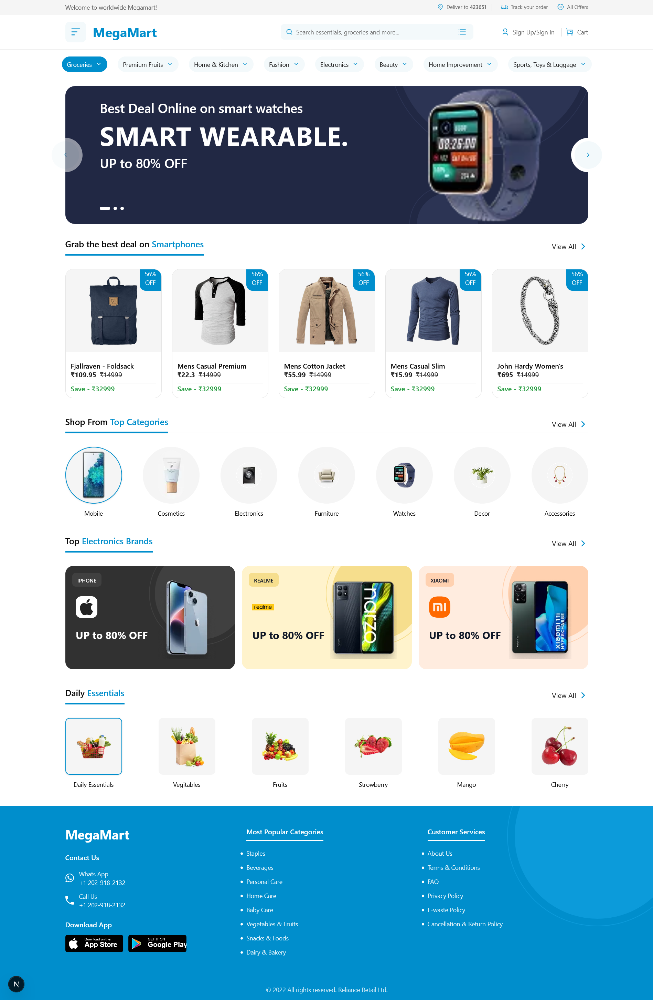

# Serv5 Task: Next.js Landing Page (E-commerce)

A modern, responsive e-commerce web application built with Next.js 16, React 19, TypeScript, and Tailwind CSS. This project features a beautiful UI with product listings, categories, carousels, and a complete shopping experience.
# [live demo](https://serv5-front-end-task.vercel.app/).


## ✨ Features

### 🎨 Modern UI Components
- **Responsive Navigation Bar** - Full-featured navbar with search, cart, and user menu
- **Hero Carousel** - Eye-catching banner carousel for promotions
- **Category Buttons** - Quick access to product categories
- **Product Cards** - Beautiful product displays with pricing and discounts
- **Top Categories** - Showcase of popular product categories
- **Electronics Brands** - Featured electronics brands carousel
- **Daily Essentials** - Quick access to everyday items
- **Footer** - Comprehensive footer with links and information

### 🚀 Technical Features
- **Server-Side Rendering (SSR)** with Next.js 16
- **React Query** for efficient data fetching and caching
- **TypeScript** for type safety
- **Tailwind CSS v4** for modern styling
- **Shadcn/ui** components for consistent UI
- **Responsive Design** - Mobile-first approach
- **Form Validation** with React Hook Form and Zod
- **State Management** with Zustand
- **Embla Carousel** for smooth carousels

## 🛠️ Tech Stack

- **Framework:** [Next.js 16.1.4](https://nextjs.org/)
- **UI Library:** [React 19.2.3](https://react.dev/)
- **Language:** [TypeScript 5](https://www.typescriptlang.org/)
- **Styling:** [Tailwind CSS v4](https://tailwindcss.com/)
- **UI Components:** [Shadcn/ui](https://ui.shadcn.com/)
- **Data Fetching:** [TanStack Query (React Query)](https://tanstack.com/query)
- **Form Handling:** [React Hook Form](https://react-hook-form.com/)
- **Validation:** [Zod](https://zod.dev/)
- **State Management:** [Zustand](https://zustand-demo.pmnd.rs/)
- **Icons:** [Lucide React](https://lucide.dev/)
- **Carousel:** [Embla Carousel](https://www.embla-carousel.com/)

## 📦 Installation

### Prerequisites
- Node.js 20.x or higher
- npm, yarn, pnpm, or bun

### Setup

1. **Clone the repository**
```bash
git clone <repository-url>
cd serv5
```

2. **Install dependencies**
```bash
npm install
# or
yarn install
# or
pnpm install
# or
bun install
```

3. **Run the development server**
```bash
npm run dev
# or
yarn dev
# or
pnpm dev
# or
bun dev
```

## 📁 Project Structure

```
serv5/
├── public/                 # Static assets
│   ├── icon/              # Icon files
│   ├── image/             # Image assets
│   └── preview.png        # Project preview
├── src/
│   ├── app/               # Next.js app directory
│   │   ├── globals.css    # Global styles
│   │   ├── layout.tsx     # Root layout
│   │   └── page.tsx       # Home page
│   ├── components/        # React components
│   │   ├── CategoryButtons/
│   │   ├── DailyEssentials/
│   │   ├── FetchProducts/
│   │   ├── Footer/
│   │   ├── HeroCarousel/
│   │   ├── Icons/
│   │   ├── Navbar/
│   │   ├── QueryProvider/
│   │   ├── SkeletonCard/
│   │   ├── TopCategories/
│   │   ├── TopElectronicsBrands/
│   │   └── ui/            # Shadcn/ui components
│   │       ├── button.tsx
│   │       ├── card.tsx
│   │       ├── carousel.tsx
│   │       ├── dropdown-menu.tsx
│   │       ├── form.tsx
│   │       ├── input.tsx
│   │       └── ...
│   └── lib/               # Utility functions
│       └── utils.ts
├── components.json        # Shadcn/ui configuration
├── next.config.ts         # Next.js configuration
├── tailwind.config.ts     # Tailwind CSS configuration
├── tsconfig.json          # TypeScript configuration
└── package.json           # Project dependencies
```

## 🌐 API Integration

The project uses the [Fake Store API](https://fakestoreapi.com/) for product data:
- **Endpoint:** `https://fakestoreapi.com/products`
- **Method:** GET
- **Response:** Array of products with id, title, price, description, category, image, and rating

## 📱 Responsive Design

The application is fully responsive with breakpoints:
- **Mobile:** < 640px
- **Tablet:** 640px - 1024px
- **Desktop:** > 1024px

**Built with ❤️ using Next.js and React**
